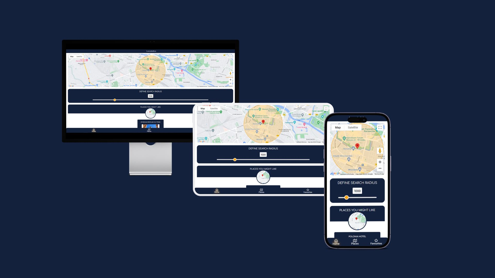

#  Locatobia 
Locatobia is a web application that uses the Google Maps API and JavaScript geolocation API to provide sightseeing recommendations to tourists who are short on time. The application takes into account the user's location and tries to find to suggest the most popular and relevant tourist attractions in the area. Tourists have the ability to filter tourist attractions by categories and also save them to favorites using Local Storage.

**Link to project:** [Locatobia Demo](https://cozy-gnome-77b50e.netlify.app/)

# Getting Started 
To run this project, you can either clone the repository or download the files as a ZIP archive.

### Prerequisites
You need a web browser with JavaScript support to run this project and valid Google API Key. 

### Installing
No installation is required. Simply open the index.html file in a web browser to run the project.

# How It's Made:

**Tech used:** HTML, CSS, JavaScript, Google Maps API

Locatobia is a web application that uses HTML, CSS, and JavaScript for the client-side. The JavaScript code in this repository follows a modular design, with each file containing code for a specific functionality of the application. It integrates with the Google Maps API and geolocation API.

The front-end of the application is built using HTML and CSS to create the layout and styling of the web pages. The Locatobia web application has a responsive design that is optimized for mobile devices, with the primary goal of providing a mobile application-like experience. The application has been designed to work seamlessly on mobile phones, with a layout that is easy to navigate using touch-based input.

The UI is minimalist in style, with a focus on providing a clean and simple user interface that allows the user to quickly find nearby tourist attractions and restaurants. The use of card-based interfaces for displaying information about the attractions and restaurants gives the application a mobile application-like feel.The JavaScript code is responsible for handling user interaction and updating the page dynamically. 

The Locatobia web application integrates with the Google Maps API and geolocation API to provide information about nearby tourist attractions and restaurants. The Google Maps API is used to display the location of the tourist attractions and restaurants on a map, while the geolocation API is used to determine the user's current location.

Locatobia uses the browser's Local Storage to save the user's favorite tourist attractions and restaurants. When the user adds a favorite, the JavaScript code stores the information in the Local Storage, and retrieves it from Local Storage when the user wants to view their favorites list.

In addition, the JavaScript code uses the ipapi API to get the user's location when geolocation is not available. The code first tries to get the user's location using the browser's geolocation API. If the user does not allow geolocation, the code uses the ipapi API to get the user's location based on their IP address. This allows the application to provide information about nearby tourist attractions and restaurants, even if the user does not allow geolocation

### Features 

* Geolocation: Locatobia uses the geolocation API to determine the user's current location and display nearby tourist attractions and restaurants.

* Adjustable Radius: Locatobia allows users to change the radius in which tourist attractions and restaurants are located.

* Google Maps Integration: Locatobia integrates with the Google Maps API to display the location of tourist attractions and restaurants on a map.

* Filtering: Users can filter their search results by attraction type and restaurant type.

* Favorites List: Users can save their favorite tourist attractions and restaurants for future reference, and delete them if they no longer need them. The favorites list is stored in the browser's Local Storage.

* IP-based location: Locatobia uses ipapi API to determine the approximate location of the user based on their IP address when the user does not allow location access through the browser.

## Lessons Learned:

During the development of Locatobia, I learned that using local storage or session storage as a substitute for a database is not a good idea. While it may seem like a convenient solution, local storage and session storage have limitations that make them unsuitable for storing large amounts of data. For Locatobia, I initially used local storage to store user favorites, but quickly realized that this was not a scalable solution.

## Examples:
Take a look at these couple examples that I have in my own portfolio:

**Interactive Linear Regression using Tensorflow.js:** https://github.com/Frosenow/Learning-Tensorflowjs

**Image Processing in Python using CUDA with Numba:** https://github.com/Frosenow/Numba-GPU-Image-Processing

**Red Planet Scout - Images from Mars:** https://github.com/Frosenow/RedPlanetScout---Mars-Photos-Gallery
